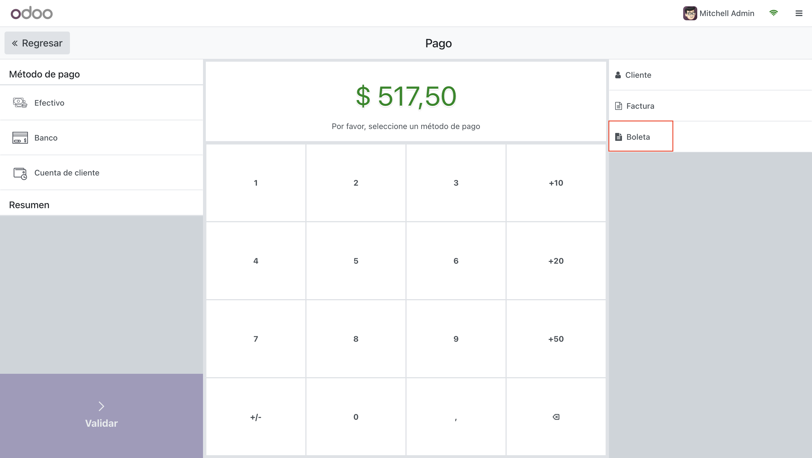

# Prueba Tecnica Odoo
## Nicole Durand Zeballos

# Dependencies
1. **Odoo 17**

# Ejercicio 1
Agregar al listado de clientes una columna con el campo “Idioma” de contacto

# Ejercicio 2
Agregar una alerta al POS cuando se seleccione un producto con precio S/ 0.0

# Ejercicio 3
Agregar un botón “Boleta” en el PaymentScreen y al dar clic al botón debe apareceruna ventana indicando el monto total a pagar.

# Ejercicio 4
Agregar un código QR a la factura inmpresa

# Ejercicio 5
Agregar campos Número de serie y Número correlativo.

# Ejercicio 6
Agregar un campo Canal de ventas.

# Ejercicio 7
Ocultar el campo Fecha de la factura y reemplazarlo por Fecha de emisión.

# Ejercicio 8
Agregar cambios al reporte impreso.

# Ejercicio 9
Aregar en en la factura con todas las transferencias relacionadas, a la venta que genero la factura.

